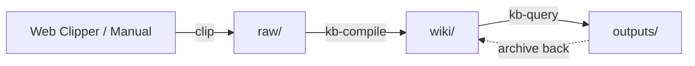

# Obsidian Notes Karpathy

LLM-driven knowledge base skills for Obsidian, inspired by [Andrej Karpathy's workflow](https://x.com/karpathy/status/2039805659525644595).

## Overview

Raw data from various sources → LLM-compiled `.md` wiki → Q&A, reports, slides — all viewable in Obsidian. You rarely edit the wiki manually; it's the LLM's domain.

```
raw/ (human adds sources) → kb-compile → wiki/ (LLM maintains) → kb-query → outputs/
```

## Skills

| Skill | Command | Description |
|-------|---------|-------------|
| **kb-init** | `kb init` | One-time setup: creates directory structure + AGENTS.md schema |
| **kb-compile** | `compile wiki` | Core engine: preprocess raw/ → compile summaries & concepts → lint |
| **kb-query** | `query kb` | Search + Q&A + multi-format output (reports, Marp slides, Mermaid, Canvas) |

## Workflow



1. **Initialize** — Run `kb-init` once to set up the vault structure
2. **Collect** — Use Obsidian Web Clipper or manually add sources to `raw/`
3. **Compile** — Run `kb-compile` to incrementally build the wiki (summaries, concepts, indices, wikilinks)
4. **Query** — Run `kb-query` to ask questions, search, or generate reports/slides/diagrams
5. **Lint** — `kb-compile` includes health checks: consistency, orphans, missing links, new article suggestions

## Directory Structure

After `kb-init`, your vault looks like:

```
vault/
├── raw/                  # Source materials (articles, papers, tweets...)
│   └── assets/           # Images from sources
├── wiki/                 # LLM-compiled wiki (don't edit manually)
│   ├── concepts/         # One article per key concept
│   ├── summaries/        # One summary per raw source
│   └── indices/          # INDEX.md, CONCEPTS.md, SOURCES.md, RECENT.md
├── outputs/              # Generated content
│   ├── reports/          # Markdown research reports
│   ├── slides/           # Marp slide decks
│   └── charts/           # Mermaid diagrams, Canvas files
└── AGENTS.md             # Schema definition for LLM agents
```

## Dependencies

These skills build on [kepano/obsidian-skills](https://github.com/kepano/obsidian-skills):

- `obsidian-markdown` — Obsidian Flavored Markdown syntax
- `obsidian-cli` — Vault interaction via CLI
- `obsidian-canvas-creator` — Canvas visualization

## Installation

Copy the `skills/obsidian-notes-karpathy/` directory into your `.claude/skills/` folder:

```bash
cp -r skills/obsidian-notes-karpathy/* ~/.claude/skills/
```

## References

- [Karpathy's "LLM Knowledge Bases" thread](https://x.com/karpathy/status/2039805659525644595)
- [kepano/obsidian-skills](https://github.com/kepano/obsidian-skills)
- [Obsidian](https://obsidian.md)

## License

MIT
