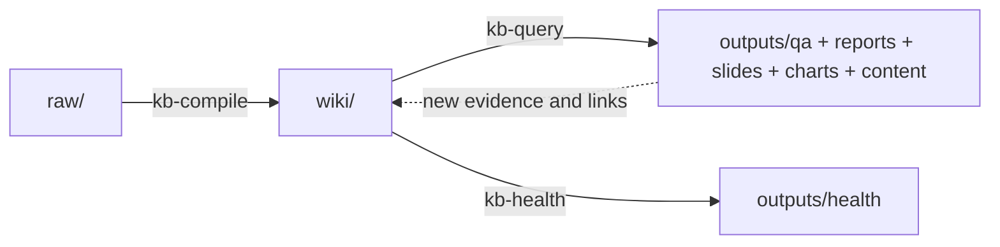

# Obsidian Notes Karpathy

> [!WARNING]
> This is a personal/self-use version. The project is currently unstable and under continuous iteration.

LLM-driven knowledge-base skills for Obsidian, inspired by Andrej Karpathy's workflow.

## What this package is

This repository ships a **bundle of Obsidian skills**, not an app. The bundle helps an agent maintain a three-layer knowledge base:

```text
raw/     -> immutable source materials curated by the human
wiki/    -> compiled markdown wiki maintained by the LLM
outputs/ -> Q&A archives, health reports, reports, slides, charts, and publishable content
```

The central idea is not "ask RAG every time". It is "compile knowledge once, keep it maintained, and reuse it". Think of the vault as a living book that keeps growing instead of a folder of dead notes.

## Package layout

```text
skills/
├── obsidian-notes-karpathy/  # package-level entry skill + bundled references/scripts/evals
│   ├── SKILL.md
│   ├── references/
│   ├── scripts/
│   └── evals/
├── kb-init/                  # initialize the vault contract
├── kb-compile/               # compile raw sources into wiki/
├── kb-query/                 # search, answer, archive, and publish from the wiki
└── kb-health/                # deep health check and maintenance review
```

## Workflow



The workflow has four concrete operations:

1. `kb-init` sets up the contract
2. `kb-compile` ingests new raw material and updates summaries, concepts, and optional entities
3. `kb-query` answers questions, archives substantial Q&A, and generates outward-facing artifacts
4. `kb-health` audits drift, contradictions, stale Q&A, and search posture

## Skills

| Skill | Purpose | Trigger examples |
|-------|---------|------------------|
| `obsidian-notes-karpathy` | Package entry and lifecycle routing | "Karpathy workflow", "LLM Wiki", "not RAG", "知识库工作流" |
| `kb-init` | Create the canonical vault structure and schema files | "kb init", "初始化知识库", "setup vault" |
| `kb-compile` | Turn new raw sources into summaries, concepts, optional entities, indices, and log entries | "compile wiki", "编译wiki", "sync wiki", "digest these notes" |
| `kb-query` | Search the wiki, answer questions, archive Q&A, feed insights back into the wiki, and generate reports/slides/charts/content drafts | "query kb", "问知识库", "write a report on", "turn my notes into a thread" |
| `kb-health` | Run deep lint and maintenance checks over the compiled wiki and recommend the next search tier | "kb health", "health check", "my notes feel disconnected" |

`obsidian-notes-karpathy` is the ambiguity router. When the operation is already explicit, prefer `kb-init`, `kb-compile`, `kb-query`, or `kb-health` directly.

## Paper PDF handling

`raw/papers/` is dual-mode:

- markdown paper notes are compiled directly
- PDF papers may carry an optional `paper-name.source.md` sidecar with metadata such as `paper_id` or `source`
- any PDF under `raw/papers/` is treated as a paper and compiled through `alphaxiv-paper-lookup`
- sidecar or filename handles remain useful metadata for provenance and debugging, but they do not decide the route
- if `alphaxiv-paper-lookup` is unavailable, the compiler should skip only the affected PDFs and tell the user what to install instead of falling back to `pdf`

Do not keep both `paper-name.md` and `paper-name.pdf` with the same basename under `raw/papers/`.

## Core design decisions

- `raw/` is immutable. Compilation state is tracked in `wiki/`, not by rewriting sources.
- `AGENTS.md` is the required local contract. `CLAUDE.md` is the generated companion, and missing only the companion should trigger repair guidance rather than block normal compile/query/health work.
- `wiki/index.md` is the content-oriented entry point.
- `wiki/log.md` is the append-only operational history across `ingest`, `query`, `publish`, and `health`.
- `outputs/qa/` stores substantive Q&A by default, so research compounds over time.
- Plain markdown indices come first.
- Backlinks, unlinked mentions, and Properties search are the next upgrade layer.
- qmd, DuckDB markdown parsing, and FTS are local-first scale upgrades before full vector infrastructure.

## Canonical vault structure

```text
vault/
├── raw/
│   ├── articles/
│   ├── papers/
│   ├── podcasts/
│   ├── assets/
│   └── repos/          # optional
├── wiki/
│   ├── concepts/
│   ├── summaries/
│   ├── indices/
│   ├── entities/       # optional
│   ├── index.md
│   └── log.md
├── outputs/
│   ├── qa/
│   ├── health/
│   ├── reports/
│   ├── slides/
│   ├── charts/
│   └── content/
│       ├── articles/
│       ├── threads/
│       └── talks/
├── AGENTS.md
└── CLAUDE.md          # generated companion
```

Optional directories are opt-in:

- `raw/repos/` for repo snapshots or repo companion notes
- `wiki/entities/` for people, organizations, products, projects, or repositories that deserve durable pages

## Installation

### Option 1: Install via `npx`

```bash
npx skills add bahayonghang/obsidian-notes-karpathy -g
```

### Option 2: Install into a project

```bash
cd /path/to/your/obsidian-vault
npx skills add bahayonghang/obsidian-notes-karpathy
```

### Option 3: Manual installation

Copy the bundle's skill directories into your skills home:

```bash
cp -r skills/* ~/.claude/skills/
```

Codex:

```bash
cp -r skills/* ~/.codex/skills/
```

PowerShell:

```powershell
Copy-Item -Recurse skills\* $env:USERPROFILE\.claude\skills\
```

## Bundle support assets

The entry skill also ships deterministic helpers and shared routing assets:

- `skills/obsidian-notes-karpathy/references/lifecycle-matrix.md`
- `skills/obsidian-notes-karpathy/scripts/detect_lifecycle.py`
- `skills/obsidian-notes-karpathy/scripts/scan_compile_delta.py`
- `skills/obsidian-notes-karpathy/scripts/lint_obsidian_mechanics.py`
- `skills/obsidian-notes-karpathy/evals/evals.json`
- `skills/obsidian-notes-karpathy/evals/trigger-evals.json`

## Recommended companion skills

This package assumes the following Obsidian-oriented skills are available:

- `obsidian-markdown`
- `obsidian-cli`
- `obsidian-canvas-creator`

For paper/PDF ingestion under `raw/papers/`, also install:

- `alphaxiv-paper-lookup` as the required paper companion for `raw/papers/*.pdf`
- `pdf` for non-paper PDF handling outside the strict `raw/papers` compile path

If `raw/papers` PDFs are still skipped unexpectedly, verify those companion skills are installed in the active skill home your agent is actually resolving from, such as `~/.codex/skills/` or `~/.claude/skills/`.

## Optional enhancements

- **Obsidian Web Clipper** for markdown-first ingestion
- **Backlinks + Properties** as the first Obsidian-native search and graph upgrade
- **qmd** for local markdown search before heavier retrieval infrastructure
- **Dataview / Datacore** for metadata-driven views inside the vault
- **DuckDB markdown + full-text search** when the vault grows beyond simple markdown navigation
- **Marp** for exporting markdown slide decks

## References

- Andrej Karpathy's knowledge-base thread: https://x.com/karpathy/status/2039805659525644595
- kepano/obsidian-skills: https://github.com/kepano/obsidian-skills
- Obsidian Web Clipper docs: https://obsidian.md/help/web-clipper
- qmd: https://github.com/tobi/qmd

## License

MIT
