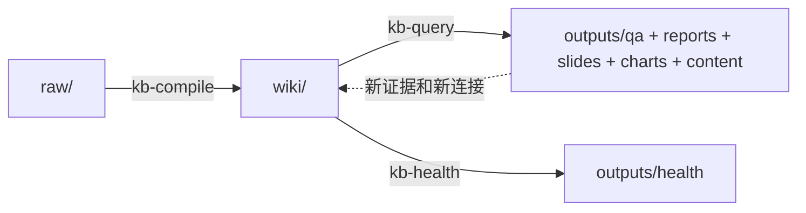

# Obsidian Notes Karpathy

> [!WARNING]
> 这是自用版本喵～。项目目前处于不稳定状态，正在持续迭代中。

基于 Andrej Karpathy 工作流的 Obsidian LLM 知识库技能包。

## 这是什么

这个仓库交付的是一组 **技能包**，不是应用程序。它帮助代理维护一个三层知识库：

```text
raw/     -> 人类整理的不可变原始资料
wiki/    -> LLM 维护的编译产物
outputs/ -> 问答沉淀、健康报告、报告、幻灯片、图表和可发布内容
```

核心思想不是“每次都临时做一遍 RAG”，而是“先编译成可维护的 wiki，再持续更新和复用”。你可以把它理解成一本会不断生长的活书，而不是一堆会腐烂的笔记。

## 包结构

```text
skills/
├── obsidian-notes-karpathy/  # 包级入口技能 + 内置 references/evals
│   ├── SKILL.md
│   ├── references/
│   └── evals/
├── kb-init/                  # 初始化知识库结构与 schema
├── kb-compile/               # 将 raw 编译到 wiki/
├── kb-query/                 # 搜索、问答、归档和内容生成
└── kb-health/                # 深度体检与维护建议
```

## 工作流



这套工作流有四个核心动作：

1. `kb-init` 建立契约
2. `kb-compile` 摄入新资料并更新摘要、概念页与可选实体页
3. `kb-query` 回答问题、归档高价值 Q&A，并生成对外内容
4. `kb-health` 审计漂移、矛盾、陈旧 Q&A 和检索升级时机

## 技能列表

| 技能 | 作用 | 触发示例 |
|------|------|---------|
| `obsidian-notes-karpathy` | 包级入口和生命周期路由 | "Karpathy workflow"、"LLM Wiki"、"不是 RAG"、"知识库工作流" |
| `kb-init` | 创建标准目录和 schema 文件 | "kb init"、"初始化知识库"、"setup vault" |
| `kb-compile` | 将新 raw 编译成摘要、概念页、可选实体页、索引和日志 | "compile wiki"、"编译wiki"、"sync wiki"、"消化这些笔记" |
| `kb-query` | 搜索 wiki、回答问题、沉淀问答、回写 wiki、生成报告/幻灯片/图表/内容草稿 | "query kb"、"问知识库"、"生成报告"、"把笔记写成推文串" |
| `kb-health` | 对编译后的 wiki 做深度体检并给出下一层检索建议 | "kb health"、"health check"、"笔记越来越散" |

## 核心设计约束

- `raw/` 是不可变层，编译状态不回写源文件。
- `wiki/index.md` 是内容入口。
- `wiki/log.md` 是 append-only 的运行历史，覆盖 `ingest`、`query`、`publish`、`health` 四类事件。
- `outputs/qa/` 默认沉淀有价值的问答，让研究结果持续复用。
- 默认先用 markdown 索引。
- 下一层优先用 Backlinks、unlinked mentions 和 Properties 搜索。
- qmd、DuckDB markdown 解析和 FTS 是向量检索之前的本地优先升级路径。

## 标准目录结构

```text
vault/
├── raw/
│   ├── articles/
│   ├── papers/
│   ├── podcasts/
│   ├── assets/
│   └── repos/          # 可选
├── wiki/
│   ├── concepts/
│   ├── summaries/
│   ├── indices/
│   ├── entities/       # 可选
│   ├── index.md
│   └── log.md
├── outputs/
│   ├── qa/
│   ├── health/
│   ├── reports/
│   ├── slides/
│   ├── charts/
│   └── content/
│       ├── articles/
│       ├── threads/
│       └── talks/
├── AGENTS.md
└── CLAUDE.md
```

可选目录按需启用：

- `raw/repos/` 用来放 repo 快照或 repo 伴随笔记
- `wiki/entities/` 用来放人物、组织、产品、项目或仓库等稳定实体页

## 安装

### 方式一：通过 `npx` 安装

```bash
npx skills add bahayonghang/obsidian-notes-karpathy -g
```

### 方式二：安装到项目目录

```bash
cd /path/to/your/obsidian-vault
npx skills add bahayonghang/obsidian-notes-karpathy
```

### 方式三：手动安装

把技能目录复制到本地 skills 目录：

```bash
cp -r skills/* ~/.claude/skills/
```

PowerShell：

```powershell
Copy-Item -Recurse skills\* $env:USERPROFILE\.claude\skills\
```

## 推荐搭配技能

这个包默认与你已有的 Obsidian 技能协作：

- `obsidian-markdown`
- `obsidian-cli`
- `obsidian-canvas-creator`

## 可选增强

- **Obsidian Web Clipper**：更稳定地采集 markdown 资料
- **Backlinks + Properties**：优先用 Obsidian 原生图谱与属性能力
- **qmd**：在更重的检索基础设施之前，先上本地 markdown 搜索
- **Dataview / Datacore**：在 Vault 内做动态元数据视图
- **DuckDB markdown + 全文检索**：当知识库变大后提供本地优先的结构化检索
- **Marp**：把 markdown 幻灯片导出为可展示内容

## 参考资料

- Andrej Karpathy 知识库线程：https://x.com/karpathy/status/2039805659525644595
- kepano/obsidian-skills：https://github.com/kepano/obsidian-skills
- Obsidian Web Clipper 文档：https://obsidian.md/help/web-clipper
- qmd：https://github.com/tobi/qmd

## License

MIT
