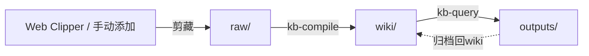

# Obsidian Notes Karpathy

基于 [Andrej Karpathy 知识管理工作流](https://x.com/karpathy/status/2039805659525644595) 的 LLM 驱动 Obsidian 知识库技能。

## 概述

从多种来源收集原始资料 → LLM 增量编译为 `.md` wiki → Q&A 问答、报告、幻灯片 —— 全部在 Obsidian 中查看。你几乎不需要手动编辑 wiki，这是 LLM 的领域。

```
raw/（人类添加资料）→ kb-compile → wiki/（LLM 维护）→ kb-query → outputs/
```

## 技能列表

| 技能 | 触发命令 | 描述 |
|------|---------|------|
| **kb-init** | `初始化知识库` / `kb init` | 一次性设置：创建目录结构 + AGENTS.md 模式定义 |
| **kb-compile** | `编译wiki` / `compile wiki` | 核心引擎：预处理 raw/ → 编译摘要和概念文章 → 健康检查 |
| **kb-query** | `问知识库` / `query kb` | 搜索 + Q&A 问答 + 多格式输出（报告、Marp 幻灯片、Mermaid 图、Canvas） |

## 工作流



1. **初始化** — 运行 `kb-init` 一次性设置 vault 结构
2. **收集** — 使用 Obsidian Web Clipper 浏览器插件或手动将资料添加到 `raw/`
3. **编译** — 运行 `kb-compile` 增量构建 wiki（摘要、概念文章、索引、wikilinks）
4. **问答** — 运行 `kb-query` 提问、搜索或生成报告/幻灯片/图表
5. **检查** — `kb-compile` 包含健康检查：一致性、孤立笔记、缺失链接、新文章建议

## 目录结构

运行 `kb-init` 后，你的 vault 结构如下：

```
vault/
├── raw/                  # 原始资料（文章、论文、推文等）
│   └── assets/           # 来源图片
├── wiki/                 # LLM 编译的 wiki（请勿手动编辑）
│   ├── concepts/         # 每个关键概念一篇文章
│   ├── summaries/        # 每个原始资料一篇摘要
│   └── indices/          # INDEX.md、CONCEPTS.md、SOURCES.md、RECENT.md
├── outputs/              # 生成的内容
│   ├── reports/          # Markdown 研究报告
│   ├── slides/           # Marp 幻灯片
│   └── charts/           # Mermaid 图表、Canvas 文件
└── AGENTS.md             # LLM 代理的模式定义
```

## 依赖

这些技能基于 [kepano/obsidian-skills](https://github.com/kepano/obsidian-skills) 构建：

- `obsidian-markdown` — Obsidian 风味 Markdown 语法
- `obsidian-cli` — 通过 CLI 与 Vault 交互
- `obsidian-canvas-creator` — Canvas 可视化

## 安装

将 `skills/obsidian-notes-karpathy/` 目录复制到你的 `.claude/skills/` 文件夹：

```bash
cp -r skills/obsidian-notes-karpathy/* ~/.claude/skills/
```

## 参考

- [Karpathy "LLM Knowledge Bases" 推文](https://x.com/karpathy/status/2039805659525644595)
- [kepano/obsidian-skills](https://github.com/kepano/obsidian-skills)
- [Obsidian](https://obsidian.md)

## 许可证

MIT
