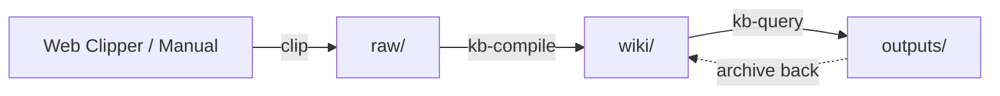

# Introduction

LLM-driven knowledge base skills for Obsidian, inspired by [Andrej Karpathy's workflow](https://x.com/karpathy/status/2039805659525644595).

## What is Obsidian Notes Karpathy?

Obsidian Notes Karpathy is a set of Claude Code skills that implement a complete knowledge management pipeline:

```
raw/ (human adds sources) → kb-compile → wiki/ (LLM maintains) → kb-query → outputs/
```

The core philosophy: **raw data is the "source of truth", the wiki is a "compiled artifact"**. You collect raw information from various sources (articles, papers, tweets, videos), then an LLM incrementally compiles it into a structured, interlinked wiki. You rarely edit the wiki manually — it's the LLM's domain.

## Why This Approach?

As Karpathy noted in his original tweet thread, once your wiki is big enough, you can ask complex questions and the LLM will research the answers by navigating the interlinked wiki. **No fancy RAG needed** — the LLM reads index files and follows wikilinks to find what it needs.

### Key Benefits

- **Deterministic & Incremental**: Like a compiler, the process is deterministic and only processes new or changed sources
- **Full Traceability**: Every claim in the wiki traces back to original sources via `[[wikilinks]]`
- **Multi-Format Output**: Generate reports, slides, diagrams, and Canvas visualizations
- **Obsidian Native**: Built on Obsidian Flavored Markdown with full support for wikilinks, callouts, and Canvas

## Core Skills

| Skill | Command | Description |
|-------|---------|-------------|
| **kb-init** | `kb init` / `初始化知识库` | One-time setup: creates directory structure + AGENTS.md schema |
| **kb-compile** | `compile wiki` / `编译wiki` | Core engine: preprocess raw/ → compile summaries & concepts → lint |
| **kb-query** | `query kb` / `问知识库` | Search + Q&A + multi-format output (reports, slides, diagrams, Canvas) |

## Quick Example



1. **Collect** an article using Obsidian Web Clipper → saved to `raw/`
2. **Compile** using `kb-compile` → summary and concepts extracted to `wiki/`
3. **Query** using `kb-query` → ask questions, get synthesized answers with source citations
4. **Output** generate a report or slide deck → saved to `outputs/`

## Next Steps

- [**Quick Start**](/guide/quick-start) — Get up and running in 5 minutes
- [**Installation**](/guide/installation) — Detailed installation instructions
- [**Skills Overview**](/skills/overview) — Understand the three core skills
- [**Workflow Guide**](/workflow/overview) — Master the complete workflow

## References

- [Karpathy's "LLM Knowledge Bases" thread](https://x.com/karpathy/status/2039805659525644595)
- [kepano/obsidian-skills](https://github.com/kepano/obsidian-skills)
- [Obsidian](https://obsidian.md)
