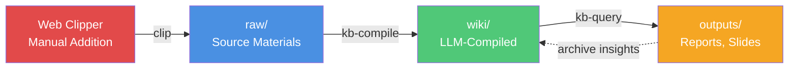

# Karpathy Workflow

Understanding the philosophy behind LLM-driven knowledge bases.

## The Original Insight

From [Andrej Karpathy's tweet thread](https://x.com/karpathy/status/2039805659525644595):

> Raw data from various sources (tweets, articles, papers, videos, code repos, podcasts) → LLM-compiled `.md` wiki → Q&A, reports, slides — all viewable in Obsidian.

The key insight: **treat knowledge management like software compilation**.

## Traditional vs. Karpathy Approach

### Traditional Knowledge Management

```
Human reads source → Human writes wiki → Human maintains wiki
```

**Problems:**
- Bottlenecked by human reading/writing speed
- Inconsistent quality and formatting
- Hard to maintain as knowledge grows
- Difficult to trace claims back to sources

### Karpathy Approach

```
Human collects sources → LLM compiles wiki → LLM maintains wiki → Human queries in Obsidian
```

**Advantages:**
- Humans focus on **curation** (what to collect)
- LLM handles **compilation** (structuring, linking, summarizing)
- Wiki is **deterministic** and **incremental** (like a compiler)
- Full **traceability** from claims to sources

## The Compilation Metaphor

Think of the knowledge base like a software project:

| Software Development | Knowledge Base |
|---------------------|----------------|
| Source code (`.c`, `.py`) | Raw sources (`raw/*.md`) |
| Compiler (`gcc`, `python`) | LLM compilation (`kb-compile`) |
| Compiled binary | Wiki (`wiki/`) |
| Debugger | Health checks (lint) |
| User manual | Reports, slides, diagrams |

### Why This Works

1. **Separation of Concerns**: Humans are good at judging what's worth collecting; LLMs are good at structuring and summarizing
2. **Incremental Updates**: Like a compiler, only process what changed
3. **Deterministic Output**: Same sources → same wiki (deterministic, not creative)
4. **Full Traceability**: Every claim traces back to `[[raw/source]]`

## The Power of Wikilinks

Obsidian's `[[wikilinks]]` are the secret sauce. They create a **graph of knowledge** where:

- **Concepts link to sources**: Every claim is traceable
- **Sources link to concepts**: Every source contributes to understanding
- **Concepts link to concepts**: Ideas are connected across the wiki

When you ask a question, the LLM:
1. Reads index files to understand the wiki structure
2. Follows wikilinks to relevant concept articles
3. Synthesizes information from multiple sources
4. Returns an answer with full citations

**No RAG needed** — the wikilinks are the retrieval mechanism.

## Workflow Diagram



## When to Use This Approach

### Ideal For

- **Research literature review**: Collect papers, synthesize findings
- **Topic deep dives**: Build comprehensive understanding over time
- **Knowledge synthesis**: Connect ideas across sources
- **Content creation**: Generate reports, talks, articles from research
- **Personal learning**: Build expertise in a domain

### Not Ideal For

- **Simple note-taking**: Use regular Obsidian notes
- **Collaborative editing**: Multiple humans editing the wiki defeats the purpose
- **Real-time information**: This is for deep, lasting knowledge

## Next Steps

- [**Directory Structure**](/guide/directory-structure) — Understand the layout
- [**AGENTS.md Schema**](/guide/agents-schema) — The LLM's rulebook
- [**Skills Overview**](/skills/overview) — The three core skills
