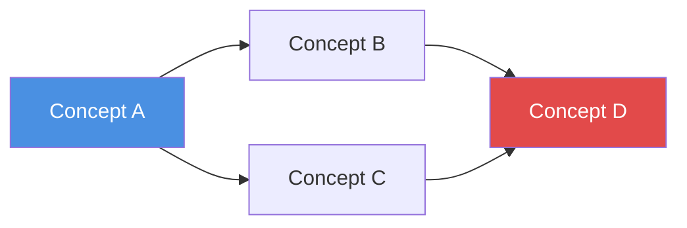
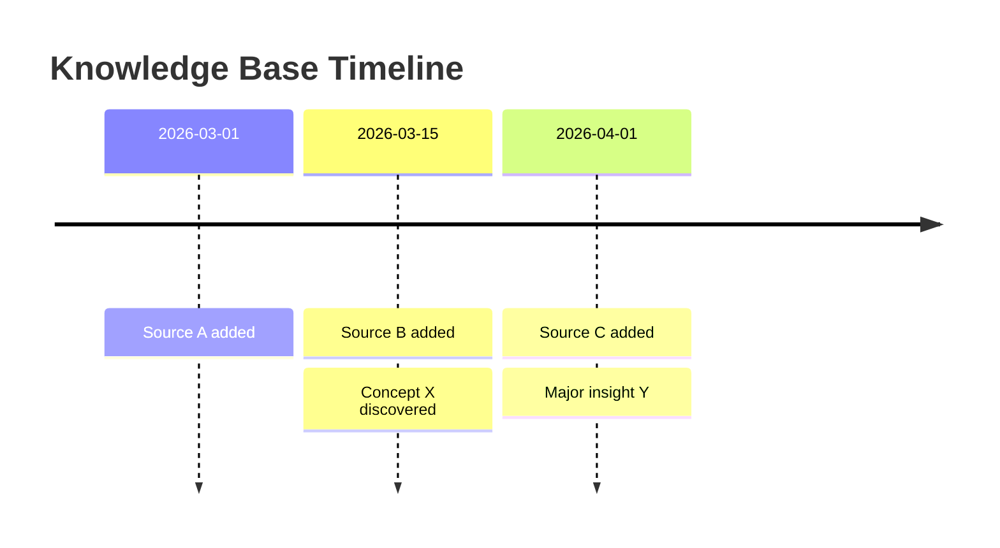
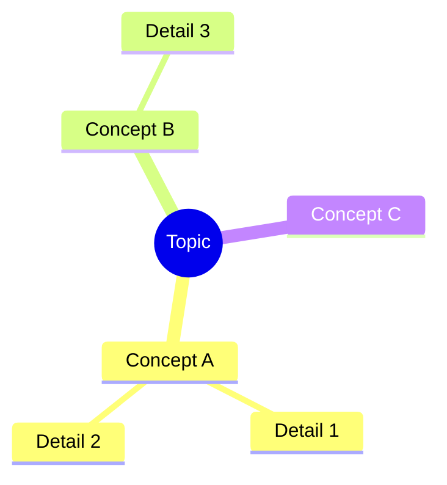

# kb-query — Search, Q&A, and Output Generation

The "consumption" side of the Karpathy knowledge base. Extract value from the compiled wiki through search, Q&A, and multi-format output generation.

## When to Use

- User asks a question about their knowledge base content
- User wants to search for specific information in the wiki
- User requests a report, slide deck, diagram, or other formatted output
- User says "问知识库", "query", "research", "search kb", "生成报告", "create slides"
- User wants to explore connections or patterns in their collected knowledge

## Prerequisites

- Knowledge base must be initialized and compiled (`kb-init` + `kb-compile`)
- `AGENTS.md` must exist at the vault/project root
- `wiki/indices/INDEX.md` should exist with current content

## Capability 1: Search

### How to Search

1. **Start with the index**: Read `wiki/indices/INDEX.md` to understand the knowledge base scope and structure
2. **Concept search**: Check `wiki/indices/CONCEPTS.md` for relevant concept articles
3. **Full-text search**: Use `obsidian-cli` (`obsidian search query="..."`) or Grep tool to search wiki content
4. **Tag-based filtering**: Search by tags in frontmatter to narrow results
5. **Source search**: Check `wiki/indices/SOURCES.md` to find raw sources by type or date

### Search Output Format

```markdown
## Search Results: "{query}"

Found {N} relevant articles:

1. **[[wiki/concepts/concept-name]]** — {one-line summary of relevance}
   > {Key excerpt from the article, 1-2 sentences}
   > Tags: #tag1 #tag2

2. **[[wiki/summaries/source-name]]** — {one-line summary of relevance}
   > {Key excerpt}

_Searched {N} articles in wiki/_
```

## Capability 2: Q&A Research

### Research Workflow

For complex questions, follow this multi-step research process:

#### Step 1: Understand the Question

Parse the user's question and identify:
- Key concepts/entities involved
- Type of answer expected (factual, analytical, comparative, exploratory)
- Scope (narrow fact vs. broad synthesis)

#### Step 2: Navigate the Wiki

1. Read `wiki/indices/INDEX.md` for the knowledge base overview
2. Read `wiki/indices/CONCEPTS.md` to find relevant concept articles
3. Open and read the most relevant concept articles
4. Follow wikilinks to discover related content
5. Check raw source summaries for detailed evidence

For complex questions, **decompose into sub-questions** and research each one.

#### Step 3: Synthesize the Answer

Compose a thorough, well-structured answer:

```markdown
## Answer: {Rephrased question as title}

{Direct answer — 1-2 paragraphs addressing the core question}

### Key Findings

1. **{Finding 1}** — {Explanation with evidence}
   - Source: [[wiki/summaries/source-name]]

2. **{Finding 2}** — {Explanation}
   - Sources: [[wiki/concepts/concept-a]], [[wiki/summaries/source-b]]

### Analysis

{Deeper analysis synthesizing multiple sources, noting patterns, contradictions, or gaps}

### References

- [[wiki/concepts/relevant-concept]] — {what it contributed}
- [[wiki/summaries/relevant-source]] — {what it contributed}
```

#### Step 4: Optional — Archive to Wiki

If the answer reveals new insights worth preserving, offer to archive it:

- **As a new concept**: Create `wiki/concepts/{new-concept}.md` if a new concept emerged
- **As a report**: Save to `outputs/reports/{date}-{topic}.md` for reference
- **Update existing concepts**: Enrich concept articles with new connections discovered during research

**Always ask the user before archiving**: "This answer revealed some interesting connections. Would you like me to archive it back into the wiki?"

## Capability 3: Multi-Format Output

### Markdown Report

For "生成报告", "create report", "write a report on...":

Save to `outputs/reports/{date}-{topic}.md`:

```markdown
---
title: "{Report Title}"
date: {date}
tags:
  - report
  - {topic}
sources_consulted: {count}
---

# {Report Title}

## Table of Contents

- [[#Executive Summary]]
- [[#Section 1]]
- [[#Section 2]]
- [[#Conclusions]]
- [[#References]]

## Executive Summary

{2-3 paragraph high-level overview}

## {Section 1}

{Detailed content with [[wikilinks]] to sources}

## {Section 2}

{Content}

## Conclusions

{Key takeaways and implications}

## References

| Source | Type | Key Contribution |
|--------|------|-----------------|
| [[source]] | {type} | {what it contributed} |
```

### Marp Slides

For "生成幻灯片", "create slides", "make a presentation":

Save to `outputs/slides/{date}-{topic}.md`. Use Marp format compatible with the Obsidian Marp Slides plugin:

```markdown
---
marp: true
theme: default
paginate: true
title: "{Presentation Title}"
---

# {Presentation Title}

{Subtitle or context}

---

## {Slide 2 Title}

- {Key point 1}
- {Key point 2}
- {Key point 3}

---

## {Slide 3 Title}

{Content — keep each slide focused on one idea}

> {Notable quote from sources}

---

## Key Takeaways

1. {Takeaway 1}
2. {Takeaway 2}
3. {Takeaway 3}

---

## References

- [[wiki/concepts/concept-a]]
- [[wiki/summaries/source-b]]
```

**Marp slide guidelines**:
- Use `---` to separate slides
- Keep each slide concise (5-7 bullet points max, or 1-2 short paragraphs)
- Include speaker notes with `<!-- speaker notes here -->` where helpful
- Use images with `` for visual slides
- Total slides: aim for 10-20 for a comprehensive topic

### Mermaid Diagrams

For "可视化", "create diagram", "show relationships", "concept map":

Generate Mermaid diagrams that render directly in Obsidian:

**Concept relationship map**:
````markdown

````

**Timeline diagram**:
````markdown

````

**Mind map**:
````markdown

````

Save standalone diagrams to `outputs/charts/{date}-{topic}.md`, or embed directly in reports.

### Obsidian Canvas

For "知识图谱", "canvas", "visual knowledge map":

Use the `obsidian-canvas-creator` skill to generate `.canvas` files that visualize:
- Concept relationship networks
- Source-to-concept mapping
- Topic clusters and categories

Save to `outputs/charts/{topic}.canvas`.

## Execution Notes

- **Always read `AGENTS.md` first** to understand this knowledge base's specific conventions
- Use `obsidian-markdown` skill for all Markdown output (wikilinks, callouts, frontmatter)
- Use `obsidian-cli` skill for searching vault content when available
- Use `obsidian-canvas-creator` skill when generating Canvas files
- When the wiki is large, **start from indices** rather than reading everything — follow links as needed
- For multi-step research, report progress: "Researching sub-question 1/3..."
- **Always cite sources with `[[wikilinks]]`** — traceability is essential
- If the wiki doesn't contain enough information to answer a question fully, **say so honestly** and suggest what sources could be added to `raw/` to fill the gap

## Next Steps

- [**Workflow: Query**](/workflow/query) — Detailed query workflow
- [**Multi-Format Output**](/workflow/query#capability-3-multi-format-output) — Output generation guide
- [**kb-compile**](/skills/kb-compile) — Understanding the compilation pipeline
