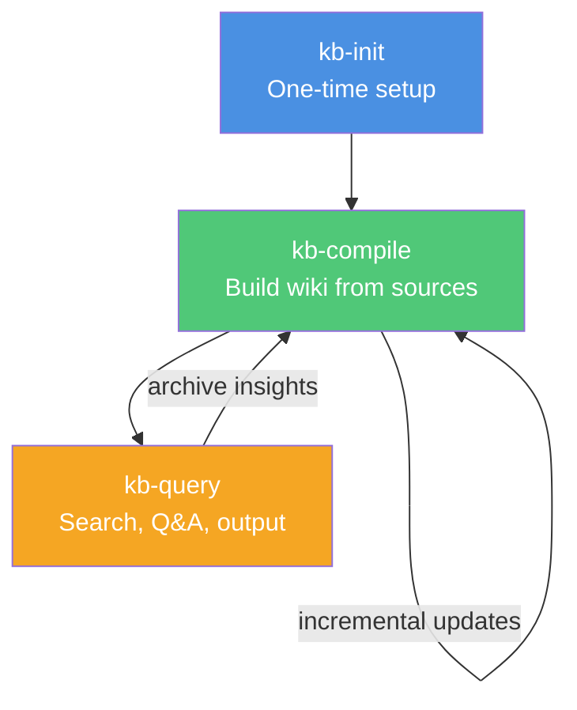

# Skills Overview

The three core skills that implement the Karpathy knowledge base workflow.

## What are Skills?

Skills are specialized instruction sets for Claude Code that define when and how to perform specific tasks. Each skill is a `SKILL.md` file with:

- **YAML frontmatter**: Name and description (used for trigger matching)
- **Markdown body**: Detailed instructions, workflows, and examples

## The Three Skills

### 1. kb-init — Knowledge Base Initialization

**Trigger**: `kb init` / `初始化知识库` / `create knowledge base` / `karpathy setup`

**Purpose**: One-time setup that creates the standard directory structure and AGENTS.md schema.

**What it does**:
- Creates `raw/`, `wiki/`, `outputs/` directory tree
- Generates `AGENTS.md` with topic-specific schema
- Creates initial index files (INDEX.md, CONCEPTS.md, SOURCES.md, RECENT.md)
- Sets up frontmatter templates

**When to use**: Once per vault/project, before adding any sources.

[**Learn more →**](/skills/kb-init)

### 2. kb-compile — Incremental Wiki Compilation

**Trigger**: `compile wiki` / `编译wiki` / `更新知识库` / `sync wiki` / `health check`

**Purpose**: The core engine that transforms raw sources into a structured, interlinked wiki.

**What it does**:
- **Phase 1: Preprocess** — Scan `raw/` for new/updated sources, validate frontmatter
- **Phase 2: Compile** — Generate summaries, extract concepts, maintain wikilinks, update indices
- **Phase 3: Health Check** — Run lint checks, detect orphans, suggest connections

**Compilation philosophy**: Raw data is "source of truth", the wiki is a "compiled artifact". Like a compiler, this process is deterministic and incremental.

[**Learn more →**](/skills/kb-compile)

### 3. kb-query — Search, Q&A, and Output

**Trigger**: `query kb` / `问知识库` / `research` / `生成报告` / `create slides` / `可视化`

**Purpose**: Extract value from the compiled wiki through search, Q&A, and multi-format output generation.

**What it does**:
- **Search** — Full-text search with concept filtering, tag-based navigation
- **Q&A Research** — Complex question answering with full source traceability
- **Multi-Format Output** — Generate Markdown reports, Marp slides, Mermaid diagrams, Canvas files

**The power move**: Once your wiki is big enough, ask complex questions and the LLM will research answers by navigating the interlinked wiki. **No RAG needed**.

[**Learn more →**](/skills/kb-query)

## How Skills Work Together



## Skill Dependencies

These skills build on [kepano/obsidian-skills](https://github.com/kepano/obsidian-skills):

| Dependency | Purpose |
|------------|---------|
| `obsidian-markdown` | Obsidian Flavored Markdown syntax (wikilinks, callouts, frontmatter) |
| `obsidian-cli` | Vault interaction via command line |
| `obsidian-canvas-creator` | Canvas visualization generation |

Make sure these are installed alongside the Karpathy skills. [Installation guide →](/guide/installation)

## Skill File Structure

Each skill follows this pattern:

```
skills/obsidian-notes-karpathy/
├── kb-init/
│   └── SKILL.md          # When to use + step-by-step workflow
├── kb-compile/
│   └── SKILL.md          # Compilation pipeline + health checks
└── kb-query/
    └── SKILL.md          # Search, Q&A, output generation
```

## Trigger Phrases

Each skill responds to both English and Chinese trigger phrases:

| Skill | English Triggers | Chinese Triggers |
|-------|-----------------|------------------|
| kb-init | "kb init", "create knowledge base", "karpathy setup" | "初始化知识库" |
| kb-compile | "compile wiki", "sync wiki", "health check" | "编译wiki", "更新知识库", "检查知识库" |
| kb-query | "query kb", "research", "create report", "create slides" | "问知识库", "生成报告", "生成幻灯片", "可视化" |

## Next Steps

- [**kb-init**](/skills/kb-init) — Detailed initialization guide
- [**kb-compile**](/skills/kb-compile) — Understanding the compilation pipeline
- [**kb-query**](/skills/kb-query) — Search, Q&A, and output generation
- [**Workflow Guide**](/workflow/overview) — Putting it all together
