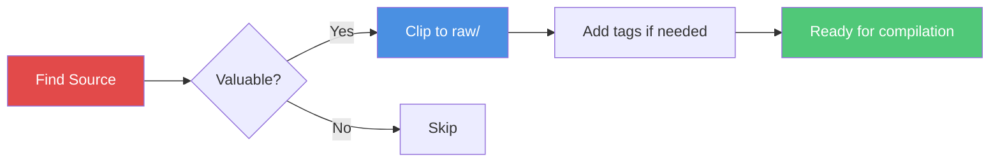

# Collect Sources

How to gather raw information for your knowledge base.

## Overview

The collection phase is the **human's primary responsibility**. You curate what goes into the knowledge base — the LLM handles everything else.

## Collection Methods

### Method 1: Obsidian Web Clipper (Recommended)

The easiest way to add web content to your knowledge base.

1. **Install** the [Obsidian Web Clipper](https://obsidian.md/clipper) extension
2. **Configure** the default vault and folder to `raw/`
3. **Clip** articles, papers, and web content

**Frontmatter**: Web Clipper automatically adds basic frontmatter. The `kb-compile` skill will enrich it during compilation.

**Images**: Saved to `raw/assets/` automatically.

### Method 2: Manual Creation

Create `.md` files directly in `raw/`:

```yaml
---
title: "Attention Is All You Need"
source: "https://arxiv.org/abs/1706.03762"
author: "Vaswani et al."
date: 2017-06-12
type: paper
tags:
  - transformers
  - attention
clipped_at: 2026-04-03T10:00:00
compiled_at: null
---

# Your notes or clipped content here

Key points from this paper...
```

### Method 3: Import from Other Sources

Convert content from:
- **PDFs**: Convert to markdown using tools like `pdftotext` or LLM extraction
- **Videos**: Use transcription services, then save as markdown
- **Podcasts**: Transcribe and summarize
- **Repositories**: Save README and key documentation

## Source Types

Each source should have a `type` in its frontmatter:

| Type | Description | Example |
|------|-------------|---------|
| `article` | Blog posts, news articles | Tech blog post |
| `paper` | Academic/research papers | arXiv paper |
| `repo` | GitHub repositories | HuggingFace model repo |
| `dataset` | Dataset documentation | ImageNet docs |
| `tweet` | Tweet threads | Karpathy's tweets |
| `video` | Video content | YouTube lecture |
| `book` | Book chapters/notes | Deep Learning book |
| `other` | Anything else | Conference notes |

## Tagging Strategy

Use hierarchical tags for organization:

```yaml
tags:
  - architecture/transformer    # Technical category
  - training/self-supervised    # Method category  
  - application/nlp             # Application category
  - concept                     # For concept articles
```

**Best practices**:
- Use 2-5 tags per source
- Follow a consistent taxonomy
- Include both specific and general tags

## File Naming

**Recommended**: `{date}-{slug}.md`

```
2026-04-03-attention-is-all-you-need.md
2026-04-05-bert-pre-training.md
```

**Alternative**: Keep original name from Web Clipper

## Quality Guidelines

Good sources have:

1. **Clear provenance**: URL, author, date are documented
2. **Substantive content**: Not just headlines or summaries
3. **Relevance**: Directly related to your knowledge base topic
4. **Authority**: From credible sources or experts in the field

## What to Collect

### High Value

- Research papers with novel insights
- In-depth technical blog posts
- Expert analysis and commentary
- Comprehensive tutorials

### Medium Value

- News articles about developments
- Conference talk summaries
- Comparative analyses

### Lower Value

- Social media posts (unless from key figures)
- Brief announcements
- Repetitive content

## Collection Workflow



## Next Steps

After collecting sources:

1. **Run `kb-compile`** to process them into the wiki
2. **Review the output** — read summaries and concepts
3. **Add more sources** as you find them
4. **Iterate** — compilation is incremental

## Tips

1. **Start small**: 3-5 sources for your first compilation
2. **Be selective**: Quality over quantity
3. **Tag consistently**: Good tags make search powerful
4. **Include URLs**: Traceability is essential
5. **Don't edit later**: The LLM will compile and structure everything

## Next Steps

- [**Compile Wiki**](/workflow/compile) — Process your sources
- [**Quick Start**](/guide/quick-start) — End-to-end workflow
- [**Directory Structure**](/guide/directory-structure) — Understanding raw/
