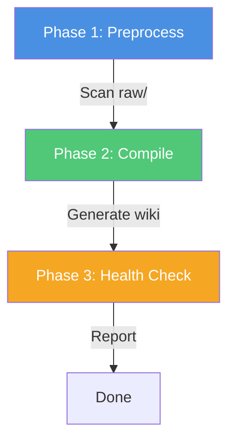

# Compile Wiki

Step-by-step guide to compiling your knowledge base wiki.

## Overview

The `kb-compile` skill is the **core engine** of the Karpathy workflow. It transforms raw sources into a structured, interlinked wiki through a deterministic, incremental process.

## When to Compile

Run compilation:

- After adding **new sources** to `raw/`
- When you've **updated** existing sources
- Periodically to **refresh** the wiki
- On demand for **health checks**

## Compilation Process

### Trigger

Say one of:

- "compile wiki" / "编译wiki"
- "更新知识库" / "sync wiki"
- "lint" / "health check" / "检查知识库"

### What Happens

The LLM executes three phases:



#### Phase 1: Preprocess (Ingest)

1. **Discover sources**: Scan `raw/` for `.md` files
2. **Check compilation status**: Compare `compiled_at` with file modification time
3. **Validate frontmatter**: Enrich missing fields
4. **Update SOURCES.md**: Rebuild source registry

**Output**: "Found X new sources, Y updated sources, Z unchanged (skipped)."

#### Phase 2: Compile (Core)

For each new/updated source:

1. **Generate summary** → `wiki/summaries/{source}.md`
2. **Extract concepts** → Create/update `wiki/concepts/{concept}.md`
3. **Maintain wikilinks**: Ensure all connections are linked
4. **Update indices**: Rebuild INDEX.md, CONCEPTS.md, RECENT.md
5. **Mark as compiled**: Set `compiled_at` timestamp

**Key behavior**:
- **Incremental**: Only processes changed sources
- **Non-destructive**: Updates existing concepts, never deletes
- **Traceable**: Every claim links back to sources

#### Phase 3: Health Check (Lint)

Automatically runs after compilation:

1. **Consistency checks**: Find contradictions, outdated info
2. **Missing data**: Detect sparse articles, incomplete frontmatter
3. **Connection discovery**: Suggest new wikilinks
4. **Orphan detection**: Find unlinked sources or concepts
5. **Generate report**: Write to `outputs/reports/health-check-{date}.md`

## Compilation Examples

### First Compilation

```
User: compile wiki

Assistant: Starting wiki compilation...

Phase 1: Preprocess
- Scanned raw/: Found 5 new sources, 0 updated, 0 unchanged

Processing: 2026-04-03-attention-is-all-you-need.md
Processing: 2026-04-03-bert-pre-training.md
...

Phase 2: Compile
- Generated 5 summaries
- Created 12 concepts
- Updated indices

Phase 3: Health Check
- Overall health: Good
- No broken links
- 2 sparse concepts detected

Compilation complete!
```

### Incremental Update

```
User: compile wiki

Assistant: Starting wiki compilation...

Phase 1: Preprocess
- Scanned raw/: Found 2 new sources, 1 updated, 7 unchanged

Processing: 2026-04-05-vision-transformer.md
Processing: 2026-04-05-swin-transformer.md
Updating: 2026-04-03-attention-is-all-you-need.md

Phase 2: Compile
- Generated 2 new summaries, updated 1
- Created 4 new concepts
- Updated 3 existing concepts (added new sources)

Phase 3: Health Check
- Overall health: Good
- 1 new connection suggested

Compilation complete!
```

## Best Practices

### 1. Compile Regularly

Don't let sources pile up uncompiled. Compile after adding 3-5 sources.

### 2. Review Output

After compilation, browse:
- `wiki/indices/INDEX.md` — Overview statistics
- `wiki/indices/CONCEPTS.md` — Concept map
- `wiki/summaries/` — Check summary quality
- `wiki/concepts/` — Read concept articles

### 3. Address Health Reports

If the health check reports issues:
- **Critical**: Fix immediately (broken links, contradictions)
- **Warnings**: Address soon (sparse content, missing tags)
- **Suggestions**: Consider for future improvements

### 4. Batch Large Compilations

If adding 10+ sources:
- Compile in batches of 5
- Review output between batches
- Prevents overwhelming the LLM

## Troubleshooting

### Issue: Nothing Compiled

**Cause**: All sources already have `compiled_at` set

**Fix**: 
- Add new sources to `raw/`
- Or modify existing sources (changes `compiled_at` check)

### Issue: Duplicate Concepts

**Cause**: LLM didn't recognize existing concept

**Fix**:
- Manually merge duplicates
- Add aliases to concept frontmatter
- Recompile

### Issue: Broken Wikilinks

**Cause**: Concept mentioned but not yet created

**Fix**:
- Run compilation (should create missing concept)
- Or manually create the concept article

## Next Steps

After compilation:

1. **Browse the wiki** in Obsidian
2. **Query the knowledge base** using `kb-query`
3. **Generate outputs** (reports, slides, diagrams)
4. **Add more sources** and recompile

## Next Steps

- [**Query & Output**](/workflow/query) — Extract value from your wiki
- [**Health Checks**](/workflow/health-checks) — Understanding lint reports
- [**kb-compile Skill**](/skills/kb-compile) — Detailed skill reference
