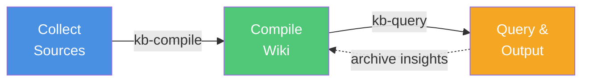

# Workflow Overview

Understanding the complete Karpathy knowledge base pipeline.

## The Pipeline



## Three Phases

### Phase 1: Collect (Human)

**Goal**: Gather raw information from various sources.

**Actions**:
- Clip articles using Obsidian Web Clipper
- Add research papers (converted to markdown)
- Save tweet threads
- Add video transcripts
- Include repository READMEs

**Output**: Files in `raw/` with frontmatter

**Who**: Human curator

### Phase 2: Compile (LLM)

**Goal**: Transform raw sources into structured wiki.

**Actions**:
- Validate and enrich frontmatter
- Generate summaries for each source
- Extract and compile concept articles
- Build wikilinks between content
- Update index files
- Run health checks

**Output**: Compiled wiki in `wiki/`

**Who**: LLM (deterministic, incremental)

### Phase 3: Query (LLM + Human)

**Goal**: Extract value from the compiled wiki.

**Actions**:
- Search for specific information
- Ask complex questions
- Generate reports
- Create slide decks
- Produce diagrams and visualizations

**Output**: Files in `outputs/`

**Who**: Human asks, LLM answers

## Key Principles

### 1. Separation of Concerns

| Role | Responsibility |
|------|---------------|
| Human | Curate sources, ask questions |
| LLM | Compile wiki, synthesize answers |

### 2. Incremental Updates

- Only process new or changed sources
- Existing concepts are updated, not recreated
- Compilation is fast because it's incremental

### 3. Full Traceability

- Every wiki claim traces to `[[raw/source]]`
- Every output cites wiki sources
- No information appears without provenance

### 4. Deterministic Output

- Same sources → same wiki
- LLM is compiler, not creator
- Reproducible results

## Workflow States

Your knowledge base evolves through stages:

### Stage 1: Empty

```
vault/
├── raw/          (empty)
├── wiki/         (indices only)
└── outputs/      (empty)
```

**Action**: Add first sources to `raw/`

### Stage 2: Growing

```
vault/
├── raw/          (5-10 sources)
├── wiki/         (20-30 concepts, summaries)
└── outputs/      (a few reports)
```

**Action**: Compile regularly, start querying

### Stage 3: Mature

```
vault/
├── raw/          (50+ sources)
├── wiki/         (100+ concepts, well-connected)
└── outputs/      (reports, slides, diagrams)
```

**Action**: Ask complex questions, generate insights

## Next Steps

- [**Collect Sources**](/workflow/collect) — Detailed collection workflow
- [**Compile Wiki**](/workflow/compile) — Step-by-step compilation guide
- [**Query & Output**](/workflow/query) — Search and output generation
- [**Health Checks**](/workflow/health-checks) — Maintain wiki quality
