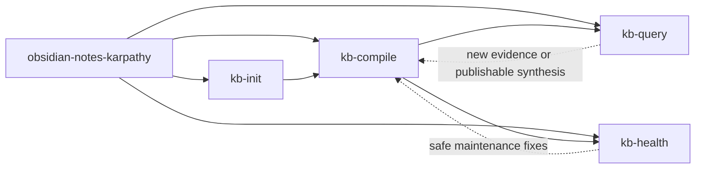

# Workflow Overview

The workflow has one routing stage and four operational stages.

## Enter by symptom

| If the vault or request looks like this | Start here |
| --- | --- |
| The contract is missing or half-built | `kb-init` |
| New raw sources have not been compiled yet | `kb-compile` |
| The user wants an answer, report, article, slides, or a thread | `kb-query` |
| The wiki feels stale, messy, or contradictory | `kb-health` |
| The correct lifecycle step is unclear | `obsidian-notes-karpathy` |

## Lifecycle stages

### 1. Initialize

`kb-init` creates or repairs the support layer so later operations have a stable contract.

### 2. Compile

`kb-compile` turns immutable raw notes into summaries, concept pages, indices, and log entries.

### 3. Query and publish

`kb-query` searches the compiled layer, answers with provenance, archives research output, and writes audience-facing derivatives when requested.

### 4. Health

`kb-health` scores integrity, drift, connectivity, freshness, and provenance, then separates safe fixes from human judgment.

## Persistent navigation surfaces

- `wiki/index.md` for content-first browsing
- `wiki/log.md` for time-first activity history
- `wiki/indices/*` for derived navigation and search posture
- `outputs/qa/` for persistent research memory
- `outputs/content/` and sibling folders for grounded deliverables
