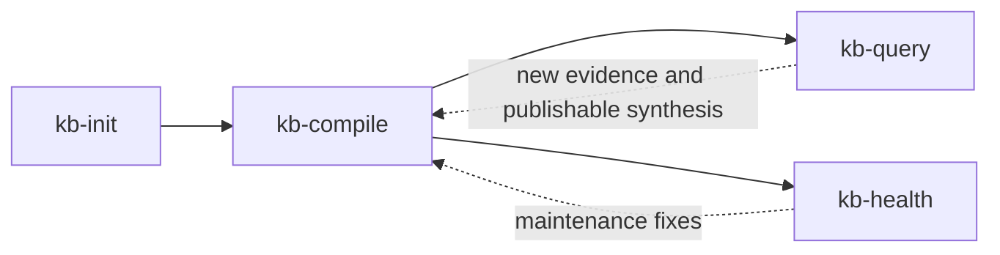

# Workflow Overview

The workflow has four operational stages after package-level routing.

## Lifecycle

### 1. Initialize

Create the canonical vault contract once.

### 2. Compile

Turn immutable raw notes into summaries, concept pages, indices, and log entries.

### 3. Query

Ask questions, generate deliverables, archive substantive answers, and create publishable artifacts from the wiki.

### 4. Health

Run deeper maintenance and integrity checks over the compiled wiki.

## Persistent navigation surfaces

- `wiki/index.md` for content-oriented browsing
- `wiki/log.md` for chronological activity
- `outputs/content/` for outward-facing drafts grounded in the wiki
