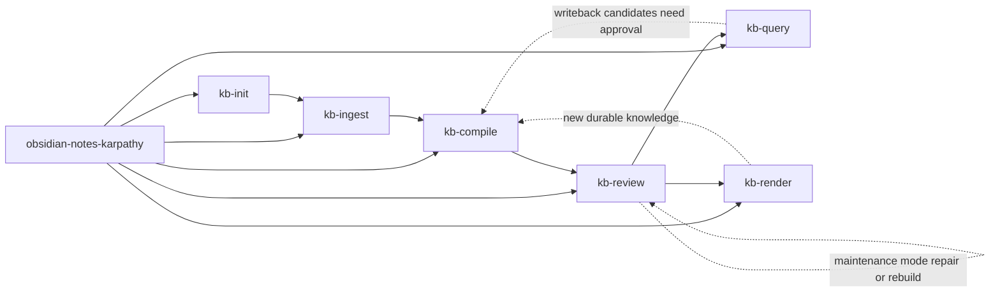

# Workflow Overview

The workflow has one routing stage and six operational stages.

## Enter by symptom

| If the vault or request looks like this | Start here |
| --- | --- |
| The contract is missing, partial, or still in a legacy-layout | `kb-init` |
| The support layer exists but the source manifest is stale | `kb-ingest` |
| New raw captures have not been compiled into drafts yet | `kb-compile` |
| Drafts are waiting for approval or briefings are stale and should be rebuilt in the next gate pass | `kb-review` |
| The user wants a grounded answer, ranked candidates, archived answer reuse, or a static web export | `kb-query` |
| The user wants a deterministic derivative such as slides, a report, a chart brief, or canvas | `kb-render` |
| The approved layer needs a maintenance baseline, drift audit, or safe cleanup pass | `kb-review` (`maintenance` mode) |
| The correct lifecycle step is unclear | `obsidian-notes-karpathy` |

If some live content exists but `wiki/drafts/`, `wiki/briefings/`, or `outputs/reviews/` is still missing, start at `kb-init` anyway. Structural repair takes priority over normal query work.

Use the package entry skill only for ambiguous, workflow-level Obsidian vault requests. If the operation is already clear, go straight to the operation-specific skill.
