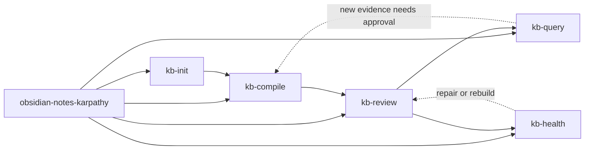

# Workflow Overview

The workflow has one routing stage and five operational stages.

## Enter by symptom

| If the vault or request looks like this | Start here |
| --- | --- |
| The contract is missing, partial, or still V1 | `kb-init` |
| New raw captures have not been compiled into drafts yet | `kb-compile` |
| Drafts are waiting for approval or briefings are stale | `kb-review` |
| The user wants an answer, report, article, slides, or a thread | `kb-query` |
| The approved layer feels stale, messy, or contradictory | `kb-health` |
| The correct lifecycle step is unclear | `obsidian-notes-karpathy` |

