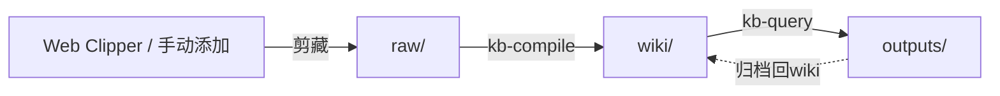

# 简介

基于 [Andrej Karpathy 的工作流](https://x.com/karpathy/status/2039805659525644595) 的 LLM 驱动 Obsidian 知识库技能。

## 什么是 Obsidian Notes Karpathy？

Obsidian Notes Karpathy 是一组 Claude Code 技能，实现了完整的知识管理流水线：

```
raw/（人类添加资料）→ kb-compile → wiki/（LLM 维护）→ kb-query → outputs/
```

核心理念：**原始数据是"真相来源"，wiki 是"编译产物"**。你从各种来源（文章、论文、推文、视频）收集原始信息，然后 LLM 增量编译为结构化的、相互链接的 wiki。你几乎不需要手动编辑 wiki —— 这是 LLM 的领域。

## 为什么采用这种方式？

正如 Karpathy 在原始推文中指出的，一旦你的 wiki 足够大，你就可以提出复杂的问题，LLM 会通过导航相互链接的 wiki 来研究答案。**不需要复杂的 RAG** —— LLM 读取索引文件并跟踪 wikilinks 找到所需内容。

### 核心优势

- **确定性 & 增量**：像编译器一样，过程是确定性的，只处理新的或更改的资料
- **完整追溯性**：wiki 中的每个声明都通过 `[[wikilinks]]` 追溯回原始资料
- **多格式输出**：生成报告、幻灯片、图表和 Canvas 可视化
- **Obsidian 原生**：基于 Obsidian 风味 Markdown，完整支持 wikilinks、callouts 和 Canvas

## 核心技能

| 技能 | 触发命令 | 描述 |
|-------|---------|-------------|
| **kb-init** | `kb init` / `初始化知识库` | 一次性设置：创建目录结构 + AGENTS.md 模式定义 |
| **kb-compile** | `compile wiki` / `编译wiki` | 核心引擎：预处理 raw/ → 编译摘要和概念文章 → 健康检查 |
| **kb-query** | `query kb` / `问知识库` | 搜索 + Q&A + 多格式输出（报告、幻灯片、图表、Canvas） |

## 快速示例



1. **收集** 使用 Obsidian Web Clipper 剪藏文章 → 保存到 `raw/`
2. **编译** 运行 `kb-compile` → 摘要和概念提取到 `wiki/`
3. **查询** 运行 `kb-query` → 提问，获得带来源引用的综合答案
4. **输出** 生成报告或幻灯片 → 保存到 `outputs/`

## 下一步

- [**快速开始**](/zh/guide/quick-start) — 5 分钟内上手
- [**安装**](/zh/guide/installation) — 详细安装说明
- [**技能概览**](/zh/skills/overview) — 了解三个核心技能
- [**工作流指南**](/zh/workflow/overview) — 掌握完整工作流

## 参考

- [Karpathy "LLM Knowledge Bases" 推文](https://x.com/karpathy/status/2039805659525644595)
- [kepano/obsidian-skills](https://github.com/kepano/obsidian-skills)
- [Obsidian](https://obsidian.md)
