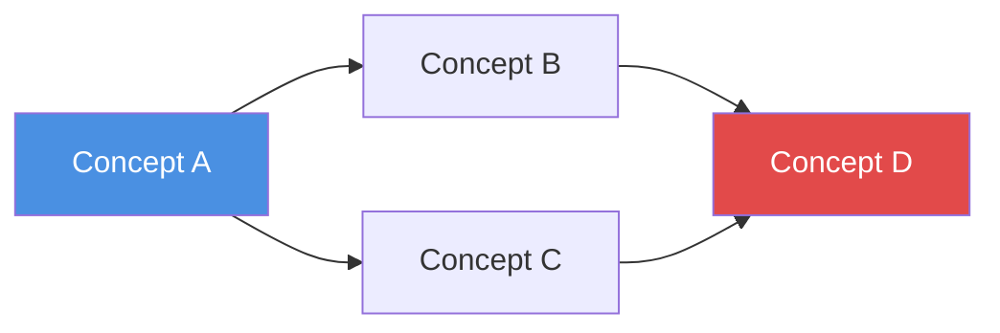
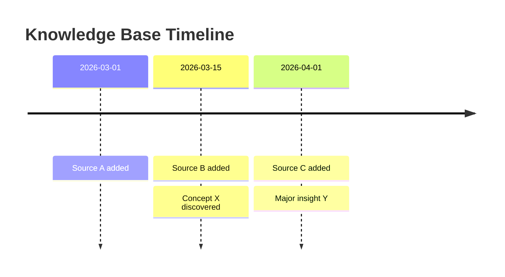
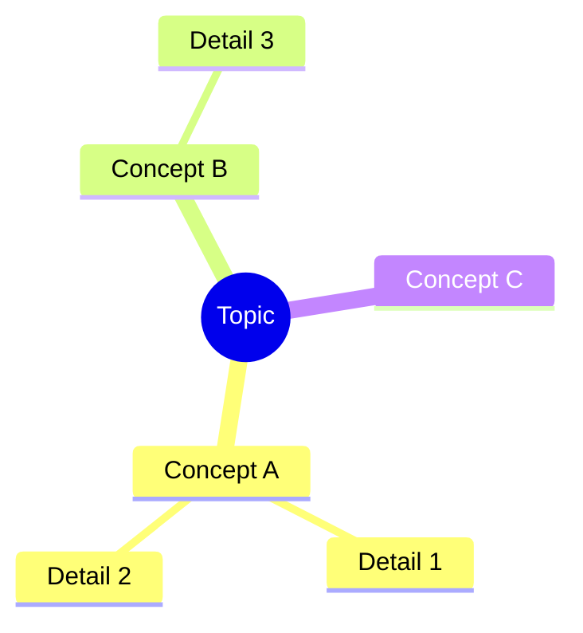

# kb-query — 搜索、问答与输出生成

Karpathy 知识库的"消费"端。通过搜索、问答和多格式输出生成，从已编译的 wiki 中提取价值。

## 使用时机

- 用户提出关于知识库内容的问题
- 用户想在 wiki 中搜索特定信息
- 用户请求报告、幻灯片、图表或其他格式化输出
- 用户说"问知识库"、"query"、"research"、"search kb"、"生成报告"、"create slides"
- 用户想探索已收集知识中的连接或模式

## 前置条件

- 知识库必须已初始化和编译（`kb-init` + `kb-compile`）
- `AGENTS.md` 必须存在于 vault/项目根目录
- `wiki/indices/INDEX.md` 应存在且包含当前内容

## 能力 1：搜索

### 如何搜索

1. **从索引开始**：阅读 `wiki/indices/INDEX.md` 以了解知识库的范围和结构
2. **概念搜索**：检查 `wiki/indices/CONCEPTS.md` 查找相关概念文章
3. **全文搜索**：使用 `obsidian-cli`（`obsidian search query="..."`）或 Grep 工具搜索 wiki 内容
4. **基于标签的过滤**：按 frontmatter 中的标签搜索以缩小结果范围
5. **源搜索**：检查 `wiki/indices/SOURCES.md` 按类型或日期查找原始源

### 搜索输出格式

```markdown
## Search Results: "{query}"

Found {N} relevant articles:

1. **[[wiki/concepts/concept-name]]** — {相关性的单行摘要}
   > {来自文章的关键摘录，1-2 句话}
   > Tags: #tag1 #tag2

2. **[[wiki/summaries/source-name]]** — {相关性的单行摘要}
   > {关键摘录}

_Searched {N} articles in wiki/_
```

## 能力 2：问答研究

### 研究工作流

对于复杂问题，遵循以下多步研究流程：

#### 步骤 1：理解问题

解析用户的问题并识别：
- 涉及的关键概念/实体
- 期望的答案类型（事实性的、分析性的、比较性的、探索性的）
- 范围（狭窄事实还是广泛综合）

#### 步骤 2：导航 Wiki

1. 阅读 `wiki/indices/INDEX.md` 获取知识库概览
2. 阅读 `wiki/indices/CONCEPTS.md` 查找相关概念文章
3. 打开并阅读最相关的概念文章
4. 跟随 wikilinks 发现相关内容
5. 检查原始源摘要以获取详细证据

对于复杂问题，**分解为子问题**并分别研究每个子问题。

#### 步骤 3：综合答案

撰写全面、结构良好的答案：

```markdown
## Answer: {将问题重新表述为标题}

{直接答案——1-2 段，回答核心问题}

### Key Findings

1. **{Finding 1}** — {解释与证据}
   - Source: [[wiki/summaries/source-name]]

2. **{Finding 2}** — {解释}
   - Sources: [[wiki/concepts/concept-a]], [[wiki/summaries/source-b]]

### Analysis

{综合多个源的深入分析，注意模式、矛盾或差距}

### References

- [[wiki/concepts/relevant-concept]] — {它的贡献}
- [[wiki/summaries/relevant-source]] — {它的贡献}
```

#### 步骤 4：可选——归档到 Wiki

如果答案揭示了值得保存的新洞察，提供归档选项：

- **作为新概念**：如果出现了新概念，创建 `wiki/concepts/{new-concept}.md`
- **作为报告**：保存到 `outputs/reports/{date}-{topic}.md` 供参考
- **更新现有概念**：用在研究期间发现的新连接丰富概念文章

**归档前始终询问用户**："这个答案揭示了一些有趣的连接。你想让我把它归档回 wiki 吗？"

## 能力 3：多格式输出

### Markdown 报告

对于"生成报告"、"create report"、"write a report on..."：

保存到 `outputs/reports/{date}-{topic}.md`：

```markdown
---
title: "{Report Title}"
date: {date}
tags:
  - report
  - {topic}
sources_consulted: {count}
---

# {Report Title}

## Table of Contents

- [[#Executive Summary]]
- [[#Section 1]]
- [[#Section 2]]
- [[#Conclusions]]
- [[#References]]

## Executive Summary

{2-3 段高层概述}

## {Section 1}

{详细内容，使用 [[wikilinks]] 链接到源}

## {Section 2}

{内容}

## Conclusions

{关键要点和影响}

## References

| Source | Type | Key Contribution |
|--------|------|-----------------|
| [[source]] | {type} | {它的贡献} |
```

### Marp 幻灯片

对于"生成幻灯片"、"create slides"、"make a presentation"：

保存到 `outputs/slides/{date}-{topic}.md`。使用与 Obsidian Marp Slides 插件兼容的 Marp 格式：

```markdown
---
marp: true
theme: default
paginate: true
title: "{Presentation Title}"
---

# {Presentation Title}

{Subtitle or context}

---

## {Slide 2 Title}

- {Key point 1}
- {Key point 2}
- {Key point 3}

---

## {Slide 3 Title}

{内容——每页幻灯片聚焦一个想法}

> {来自源的值得注意的引用}

---

## Key Takeaways

1. {Takeaway 1}
2. {Takeaway 2}
3. {Takeaway 3}

---

## References

- [[wiki/concepts/concept-a]]
- [[wiki/summaries/source-b]]
```

**Marp 幻灯片指南**：
- 使用 `---` 分隔幻灯片
- 保持每页简洁（最多 5-7 个要点，或 1-2 个短段落）
- 在需要时使用 `<!-- speaker notes here -->` 添加演讲者备注
- 使用 `` 添加视觉幻灯片
- 总幻灯片数：综合主题目标 10-20 页

### Mermaid 图表

对于"可视化"、"create diagram"、"show relationships"、"concept map"：

生成可在 Obsidian 中直接渲染的 Mermaid 图表：

**概念关系图**：
````markdown

````

**时间线图**：
````markdown

````

**思维导图**：
````markdown

````

将独立图表保存到 `outputs/charts/{date}-{topic}.md`，或直接嵌入到报告中。

### Obsidian Canvas

对于"知识图谱"、"canvas"、"visual knowledge map"：

使用 `obsidian-canvas-creator` 技能生成 `.canvas` 文件，可视化：
- 概念关系网络
- 源到概念的映射
- 主题簇和类别

保存到 `outputs/charts/{topic}.canvas`。

## 执行说明

- **始终先阅读 `AGENTS.md`** 以了解此知识库的特定约定
- 使用 `obsidian-markdown` 技能处理所有 Markdown 输出（wikilinks、callouts、frontmatter）
- 使用 `obsidian-cli` 技能在可用时搜索 vault 内容
- 生成 Canvas 文件时使用 `obsidian-canvas-creator` 技能
- 当 wiki 较大时，**从索引开始**而不是阅读所有内容——根据需要跟随链接
- 对于多步研究，报告进度："正在研究子问题 1/3..."
- **始终使用 `[[wikilinks]]` 引用源**——可追溯性至关重要
- 如果 wiki 不包含足够信息来充分回答问题，**诚实说明**并建议可以向 `raw/` 添加哪些源来填补空白

## 下一步

- [**工作流：查询**](/workflow/query) — 详细查询工作流
- [**多格式输出**](/workflow/query#capability-3-multi-format-output) — 输出生成指南
- [**kb-compile**](/skills/kb-compile) — 理解编译流水线
