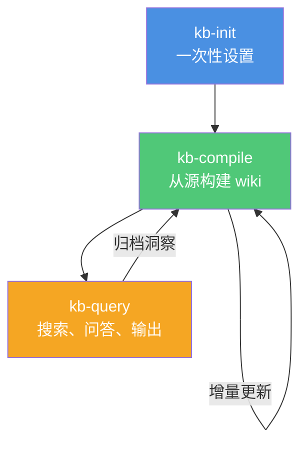

# 技能概览

实现 Karpathy 知识库工作流的三个核心技能。

## 什么是技能？

技能是 Claude Code 的专用指令集，定义何时以及如何执行特定任务。每个技能都是一个 `SKILL.md` 文件，包含：

- **YAML frontmatter**：名称和描述（用于触发匹配）
- **Markdown 正文**：详细指令、工作流和示例

## 三个技能

### 1. kb-init — 知识库初始化

**触发**：`kb init` / `初始化知识库` / `create knowledge base` / `karpathy setup`

**用途**：一次性设置，创建标准目录结构和 AGENTS.md schema。

**功能**：
- 创建 `raw/`、`wiki/`、`outputs/` 目录树
- 生成带有主题特定 schema 的 `AGENTS.md`
- 创建初始索引文件（INDEX.md、CONCEPTS.md、SOURCES.md、RECENT.md）
- 设置 frontmatter 模板

**何时使用**：每个 vault/项目一次，在添加任何源之前。

[**了解更多 →**](/skills/kb-init)

### 2. kb-compile — 增量 Wiki 编译

**触发**：`compile wiki` / `编译wiki` / `更新知识库` / `sync wiki` / `health check`

**用途**：核心引擎，将原始源转换为结构化的、相互链接的 wiki。

**功能**：
- **第一阶段：预处理** — 扫描 `raw/` 查找新/更新的源，验证 frontmatter
- **第二阶段：编译** — 生成摘要、提取概念、维护 wikilinks、更新索引
- **第三阶段：健康检查** — 运行 lint 检查、检测孤立、建议连接

**编译理念**：原始数据是"事实来源"，wiki 是"编译产物"。像编译器一样，这个过程是确定性的和增量的。

[**了解更多 →**](/skills/kb-compile)

### 3. kb-query — 搜索、问答与输出

**触发**：`query kb` / `问知识库` / `research` / `生成报告` / `create slides` / `可视化`

**用途**：通过搜索、问答和多格式输出生成，从已编译的 wiki 中提取价值。

**功能**：
- **搜索** — 全文搜索，带概念过滤、基于标签的导航
- **问答研究**：复杂问题回答，带完整的源可追溯性
- **多格式输出** — 生成 Markdown 报告、Marp 幻灯片、Mermaid 图表、Canvas 文件

**强大之处**：当你的 wiki 足够大时，提出复杂问题，LLM 会通过导航相互链接的 wiki 来研究答案。**不需要 RAG**。

[**了解更多 →**](/skills/kb-query)

## 技能如何协同工作



## 技能依赖

这些技能构建于 [kepano/obsidian-skills](https://github.com/kepano/obsidian-skills) 之上：

| 依赖 | 用途 |
|------|------|
| `obsidian-markdown` | Obsidian Flavored Markdown 语法（wikilinks、callouts、frontmatter） |
| `obsidian-cli` | 通过命令行与 Vault 交互 |
| `obsidian-canvas-creator` | Canvas 可视化生成 |

确保这些与 Karpathy 技能一起安装。[安装指南 →](/guide/installation)

## 技能文件结构

每个技能遵循以下模式：

```
skills/obsidian-notes-karpathy/
├── kb-init/
│   └── SKILL.md          # 何时使用 + 逐步工作流
├── kb-compile/
│   └── SKILL.md          # 编译流水线 + 健康检查
└── kb-query/
    └── SKILL.md          # 搜索、问答、输出生成
```

## 触发短语

每个技能响应英文和中文触发短语：

| 技能 | 英文触发 | 中文触发 |
|------|---------|---------|
| kb-init | "kb init", "create knowledge base", "karpathy setup" | "初始化知识库" |
| kb-compile | "compile wiki", "sync wiki", "health check" | "编译wiki", "更新知识库", "检查知识库" |
| kb-query | "query kb", "research", "create report", "create slides" | "问知识库", "生成报告", "生成幻灯片", "可视化" |

## 下一步

- [**kb-init**](/skills/kb-init) — 详细初始化指南
- [**kb-compile**](/skills/kb-compile) — 理解编译流水线
- [**kb-query**](/skills/kb-query) — 搜索、问答和输出生成
- [**工作流指南**](/workflow/overview) — 整合所有部分