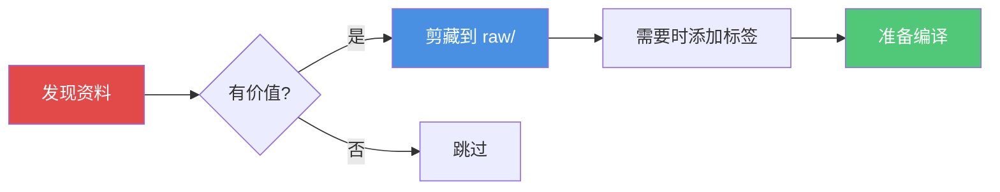

# 收集资料

如何为你的知识库收集原始信息。

## 概览

收集阶段是**人类的主要职责**。你策划进入知识库的内容 —— LLM 处理其他一切。

## 收集方法

### 方法 1：Obsidian Web Clipper（推荐）

向知识库添加网络内容最简单的方式。

1. **安装** [Obsidian Web Clipper](https://obsidian.md/clipper) 浏览器扩展
2. **配置** 默认 vault 和文件夹为 `raw/`
3. **剪藏** 文章、论文和网页内容

**Frontmatter**：Web Clipper 会自动添加基本 frontmatter。`kb-compile` 技能会在编译时补充。

**图片**：自动保存到 `raw/assets/`。

### 方法 2：手动创建

直接在 `raw/` 中创建 `.md` 文件：

```yaml
---
title: "Attention Is All You Need"
source: "https://arxiv.org/abs/1706.03762"
author: "Vaswani et al."
date: 2017-06-12
type: paper
tags:
  - transformers
  - attention
clipped_at: 2026-04-03T10:00:00
compiled_at: null
---

# 你的笔记或剪藏内容

本文的关键要点...
```

### 方法 3：从其他来源导入

转换以下来源的内容：
- **PDF**：使用 `pdftotext` 或 LLM 提取转换为 markdown
- **视频**：使用转录服务，然后保存为 markdown
- **播客**：转录和总结
- **代码仓库**：保存 README 和关键文档

## 资料类型

每个资料应在 frontmatter 中标注 `type`：

| 类型 | 描述 | 示例 |
|------|------|------|
| `article` | 博客文章、新闻文章 | 技术博客 |
| `paper` | 学术/研究论文 | arXiv 论文 |
| `repo` | GitHub 仓库 | HuggingFace 模型仓库 |
| `dataset` | 数据集文档 | ImageNet 文档 |
| `tweet` | 推文串 | Karpathy 的推文 |
| `video` | 视频内容 | YouTube 讲座 |
| `book` | 书章节/笔记 | 深度学习书籍 |
| `other` | 其他任何内容 | 会议笔记 |

## 标签策略

使用分层标签进行组织：

```yaml
tags:
  - architecture/transformer    # 技术类别
  - training/self-supervised    # 方法类别  
  - application/nlp             # 应用类别
  - concept                     # 用于概念文章
```

**最佳实践**：
- 每个资料使用 2-5 个标签
- 遵循一致的分类法
- 包含具体和通用的标签

## 文件命名

**推荐**：`{date}-{slug}.md`

```
2026-04-03-attention-is-all-you-need.md
2026-04-05-bert-pre-training.md
```

**替代方案**：保留 Web Clipper 的原始名称

## 质量指南

优质资料应具备：

1. **清晰的来源**：URL、作者、日期都有记录
2. **实质性内容**：不只是标题或摘要
3. **相关性**：与知识库主题直接相关
4. **权威性**：来自可信来源或领域专家

## 收集什么

### 高价值

- 具有新颖见解的研究论文
- 深入的技术博客文章
- 专家分析和评论
- 全面的教程

### 中等价值

- 关于发展的新闻文章
- 会议演讲摘要
- 比较分析

### 较低价值

- 社交媒体帖子（除非来自关键人物）
- 简短公告
- 重复内容

## 收集工作流



## 下一步

收集资料后：

1. **运行 `kb-compile`** 将它们处理为 wiki
2. **检查输出** — 阅读摘要和概念
3. **添加更多资料** 随着发现
4. **迭代** — 编译是增量的

## 技巧

1. **从小开始**：首次编译使用 3-5 份资料
2. **精挑细选**：质量胜于数量
3. **一致标签**：好标签让搜索更强大
4. **包含 URL**：追溯性至关重要
5. **之后不要编辑**：LLM 会编译和结构化一切

## 下一步

- [**编译 Wiki**](/zh/workflow/compile) — 处理你的资料
- [**快速开始**](/zh/guide/quick-start) — 端到端工作流
- [**目录结构**](/zh/guide/directory-structure) — 了解 raw/
