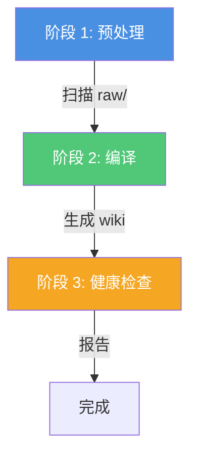

# 编译 Wiki

编译知识库 wiki 的逐步指南。

## 概览

`kb-compile` 技能是 Karpathy 工作流的**核心引擎**。它通过确定性、增量的过程将原始资料转化为结构化的、相互链接的 wiki。

## 何时编译

运行编译：

- 向 `raw/` 添加**新资料**后
- 当你**更新**了现有资料
- 定期**刷新** wiki
- 按需进行**健康检查**

## 编译过程

### 触发

说以下之一：

- "compile wiki" / "编译wiki"
- "更新知识库" / "sync wiki"
- "lint" / "health check" / "检查知识库"

### 会发生什么

LLM 执行三个阶段：



#### 阶段 1：预处理（摄入）

1. **发现资料**：扫描 `raw/` 中的 `.md` 文件
2. **检查编译状态**：比较 `compiled_at` 与文件修改时间
3. **验证 frontmatter**：补充缺失字段
4. **更新 SOURCES.md**：重建资料注册表

**输出**："发现 X 份新资料，Y 份更新，Z 份未变（跳过）。"

#### 阶段 2：编译（核心）

对于每份新/更新的资料：

1. **生成摘要** → `wiki/summaries/{资料}.md`
2. **提取概念** → 创建/更新 `wiki/concepts/{概念}.md`
3. **维护 wikilinks**：确保所有连接都已链接
4. **更新索引**：重建 INDEX.md、CONCEPTS.md、RECENT.md
5. **标记为已编译**：设置 `compiled_at` 时间戳

**关键行为**：
- **增量**：只处理更改的资料
- **非破坏性**：更新现有概念，从不删除
- **可追溯**：每个声明都链接回资料

#### 阶段 3：健康检查（Lint）

编译后自动运行：

1. **一致性检查**：查找矛盾、过时信息
2. **缺失数据检测**：发现稀疏文章、不完整 frontmatter
3. **连接发现**：建议新的 wikilinks
4. **孤立检测**：查找未链接的资料或概念
5. **生成报告**：写入 `outputs/reports/health-check-{date}.md`

## 编译示例

### 首次编译

```
用户：compile wiki

助手：开始编译 wiki...

阶段 1：预处理
- 扫描 raw/：发现 5 份新资料，0 份更新，0 份未变

正在处理：2026-04-03-attention-is-all-you-need.md
正在处理：2026-04-03-bert-pre-training.md
...

阶段 2：编译
- 生成 5 份摘要
- 创建 12 个概念
- 更新索引

阶段 3：健康检查
- 整体健康状态：良好
- 无断链
- 检测到 2 个稀疏概念

编译完成！
```

### 增量更新

```
用户：compile wiki

助手：开始编译 wiki...

阶段 1：预处理
- 扫描 raw/：发现 2 份新资料，1 份更新，7 份未变

正在处理：2026-04-05-vision-transformer.md
正在处理：2026-04-05-swin-transformer.md
正在更新：2026-04-03-attention-is-all-you-need.md

阶段 2：编译
- 生成 2 份新摘要，更新 1 份
- 创建 4 个新概念
- 更新 3 个现有概念（添加新资料）

阶段 3：健康检查
- 整体健康状态：良好
- 建议 1 个新连接

编译完成！
```

## 最佳实践

### 1. 定期编译

不要让资料堆积不编译。添加 3-5 份资料后编译。

### 2. 检查输出

编译后，浏览：
- `wiki/indices/INDEX.md` — 概览统计
- `wiki/indices/CONCEPTS.md` — 概念地图
- `wiki/summaries/` — 检查摘要质量
- `wiki/concepts/` — 阅读概念文章

### 3. 处理健康报告

如果健康检查报告问题：
- **关键**：立即修复（断链、矛盾）
- **警告**：尽快处理（稀疏内容、缺失标签）
- **建议**：考虑未来改进

### 4. 大批次编译

如果添加 10+ 份资料：
- 分批编译，每批 5 份
- 批次之间检查输出
- 防止 LLM 超载

## 故障排除

### 问题：没有编译任何内容

**原因**：所有资料已有 `compiled_at` 设置

**修复**：
- 向 `raw/` 添加新资料
- 或修改现有资料（更改 `compiled_at` 检查）

### 问题：重复概念

**原因**：LLM 未识别现有概念

**修复**：
- 手动合并重复项
- 向概念 frontmatter 添加别名
- 重新编译

### 问题：断链 wikilinks

**原因**：概念被提及但尚未创建

**修复**：
- 运行编译（应创建缺失概念）
- 或手动创建概念文章

## 下一步

编译后：

1. **在 Obsidian 中浏览 wiki**
2. **使用 `kb-query` 查询知识库**
3. **生成输出**（报告、幻灯片、图表）
4. **添加更多资料**并重新编译

## 下一步

- [**查询与输出**](/zh/workflow/query) — 从 wiki 中提取价值
- [**健康检查**](/zh/workflow/health-checks) — 理解 lint 报告
- [**kb-compile 技能**](/zh/skills/kb-compile) — 详细技能参考
