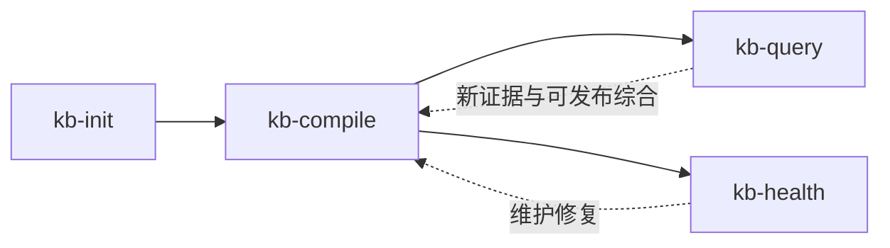

# 工作流概览

包级路由之后，工作流分为四个操作阶段。

## 生命周期

### 1. 初始化

一次性建立 vault 契约。

### 2. 编译

把 immutable raw 编译成摘要、概念页、索引和日志。

### 3. 查询

提问、生成交付物、沉淀实质性问答，并把 wiki 转成对外内容。

### 4. 体检

对编译后的 wiki 做更深的完整性和一致性检查。

## 持久入口

- `wiki/index.md`：内容浏览入口
- `wiki/log.md`：时间线
- `outputs/content/`：文章、推文串、分享提纲
