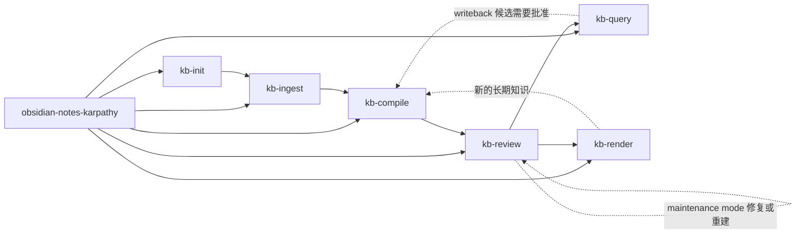

# 工作流总览

## 按症状进入

| 如果当前更像这样 | 先走哪一步 |
| --- | --- |
| 支撑层缺失、半成品、或还是 legacy-layout | `kb-init` |
| 支撑层存在，但 source manifest 已经过期 | `kb-ingest` |
| 新 raw 捕获还没编译到草稿层 | `kb-compile` |
| 草稿待审，或 briefing 已过期且应在下一次 gate pass 中重建 | `kb-review` |
| 用户要 grounded answer、候选排序、历史答案复用或静态 web 导出 | `kb-query` |
| 用户想要确定性的 slides / report / chart brief / canvas | `kb-render` |
| 批准层需要维护基线、drift 审计或安全清理 | `kb-review`（`maintenance` mode） |
| 当前到底该走哪一步不清楚 | `obsidian-notes-karpathy` |

如果已经出现少量 live 内容，但 `wiki/drafts/`、`wiki/briefings/`、`outputs/reviews/` 仍然缺失，也要先走 `kb-init`。结构修复优先于正常 query。

只有当请求是工作流级别且当前步骤不明确时，才先走入口技能。操作已经明确时，直接用对应的操作技能。
