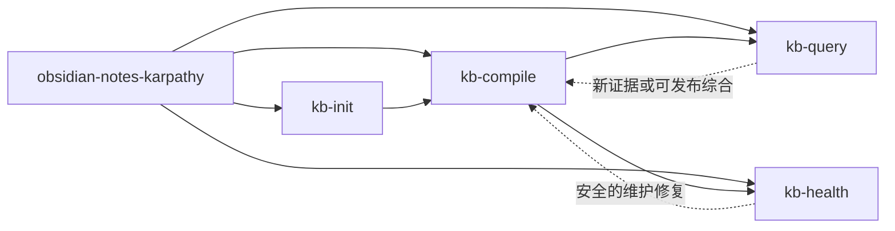

# 工作流概览

整套流程包含一个路由阶段和四个操作阶段。

## 先按症状进入

| 如果 Vault 或请求更像这样 | 先从哪里开始 |
| --- | --- |
| 契约层缺失或只搭了一半 | `kb-init` |
| `raw/` 里有新资料但还没编译 | `kb-compile` |
| 用户想要答案、报告、文章、幻灯片或推文串 | `kb-query` |
| wiki 越来越乱、越来越旧、越来越互相打架 | `kb-health` |
| 当前到底该做哪一步还不清楚 | `obsidian-notes-karpathy` |

## 生命周期阶段

### 1. 初始化

`kb-init` 负责把支撑层创建或修复好，让后续技能有稳定契约可依赖。

### 2. 编译

`kb-compile` 负责把不可变 raw 编译成摘要、概念页、索引和日志。

### 3. 查询与发布

`kb-query` 负责从编译层检索、回答、归档研究结果，并在需要时生成对外内容。

### 4. 体检

`kb-health` 负责给完整性、漂移、连通性、新鲜度和溯源质量打分，并区分自动修复项与判断题。

## 持久导航面

- `wiki/index.md`：内容优先入口
- `wiki/log.md`：时间优先入口
- `wiki/indices/*`：派生导航和检索入口
- `outputs/qa/`：持久研究记忆
- `outputs/content/` 及同级输出目录：基于 wiki 证据层生成的交付物
