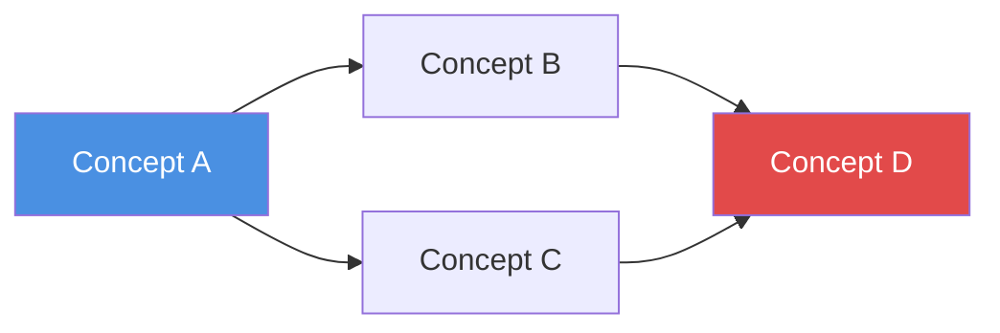
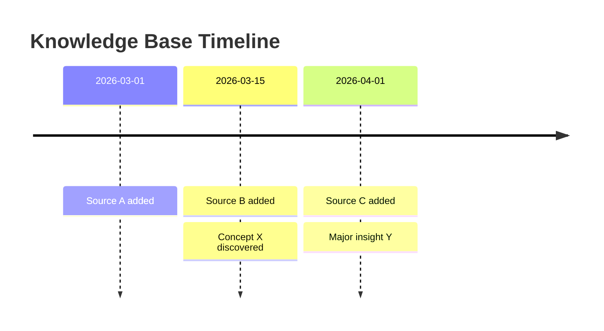
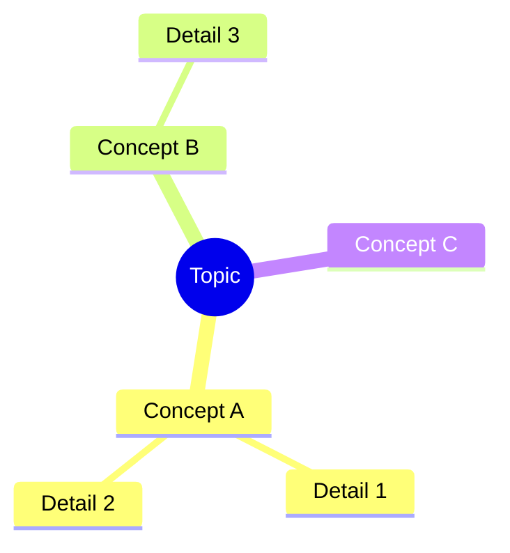

# KB Query — Search, Q&A, and Output Generation

The "consumption" side of the Karpathy knowledge base. Once raw sources are compiled into a wiki, this skill helps you extract value: ask complex questions, search for specific information, and generate polished outputs in multiple formats.

The power of this approach (as Karpathy noted): once your wiki is big enough, you can ask complex questions and the LLM will research the answers by navigating the interlinked wiki. No fancy RAG needed — the LLM reads index files and follows wikilinks to find what it needs.

## When to Use

- User asks a question about their knowledge base content
- User wants to search for specific information in the wiki
- User requests a report, slide deck, diagram, or other formatted output
- User says "问知识库", "query", "research", "search kb", "生成报告", "create slides"
- User wants to explore connections or patterns in their collected knowledge

## Prerequisites

- Knowledge base must be initialized and compiled (`kb-init` + `kb-compile`)
- `AGENTS.md` must exist at the vault/project root
- `wiki/indices/INDEX.md` should exist with current content

## Capability 1: Search

### How to search

1. **Start with the index**: Read `wiki/indices/INDEX.md` to understand the knowledge base scope and structure
2. **Concept search**: Check `wiki/indices/CONCEPTS.md` for relevant concept articles
3. **Full-text search**: Use `obsidian-cli` (`obsidian search query="..."`) or Grep tool to search wiki content
4. **Tag-based filtering**: Search by tags in frontmatter to narrow results
5. **Source search**: Check `wiki/indices/SOURCES.md` to find raw sources by type or date

### Search output format

Return results as a structured list with context:

```markdown
## Search Results: "{query}"

Found {N} relevant articles:

1. **[[wiki/concepts/concept-name]]** — {one-line summary of relevance}
   > {Key excerpt from the article, 1-2 sentences}
   > Tags: #tag1 #tag2

2. **[[wiki/summaries/source-name]]** — {one-line summary of relevance}
   > {Key excerpt}

_Searched {N} articles in wiki/_
```

## Capability 2: Q&A Research

The core philosophy: **every conversation with the LLM adds a new layer to the knowledge base.** Q&A results are not disposable chat history — they are knowledge artifacts that accumulate over time, making future research faster and richer.

### Research workflow

For complex questions, follow this multi-step research process:

#### Step 1: Understand the question

Parse the user's question and identify:
- Key concepts/entities involved
- Type of answer expected (factual, analytical, comparative, exploratory)
- Scope (narrow fact vs. broad synthesis)

#### Step 2: Check existing Q&A

Before researching from scratch, check if this question (or a similar one) has already been answered:

1. Search `outputs/qa/` for files with related keywords in filename or `question` frontmatter
2. If a matching Q&A exists and is still relevant:
   - Use it as the research starting point — cite it and build on it
   - If fully sufficient, return the existing answer with a note: "This was previously researched on {date}"
3. If a partial match exists, read it first to avoid redundant work, then extend the research

This avoids re-deriving answers that already exist in the knowledge base.

#### Step 3: Navigate the wiki

1. Read `wiki/indices/INDEX.md` for the knowledge base overview
2. Read `wiki/indices/CONCEPTS.md` to find relevant concept articles
3. Open and read the most relevant concept articles
4. Follow wikilinks to discover related content
5. Check raw source summaries for detailed evidence

For complex questions, decompose into sub-questions and research each one.

#### Step 4: Synthesize and archive the answer

Compose a thorough answer and **save it by default** to `outputs/qa/{date}-{slug}.md`. This is not optional — every substantive Q&A interaction produces a persistent knowledge artifact.

The Q&A file format:

```markdown
---
question: "{The user's original question}"
asked_at: {date}
sources:
  - "[[raw/source-1]]"
  - "[[wiki/concepts/concept-a]]"
tags:
  - qa
  - {topic/subtopic}
---

# {Rephrased question as title}

## TL;DR

{One-sentence conclusion — the most direct answer to the question}

## Conclusions

{2-4 paragraphs covering the detailed answer, arguments, and reasoning}

### Key Findings

1. **{Finding 1}** — {Explanation with evidence}
   - Source: [[wiki/summaries/source-name]]

2. **{Finding 2}** — {Explanation}
   - Sources: [[wiki/concepts/concept-a]], [[wiki/summaries/source-b]]

## Evidence

{Link back to original sources with specific references}

- [[wiki/concepts/relevant-concept]] — {what it contributed}
- [[wiki/summaries/relevant-source]] — {what it contributed}
- [[raw/original-article]] — {specific paragraph or data point}

## Uncertainty

{Knowledge gaps, unverified claims, contradictions found, and what additional sources could help}

- {What we don't know yet}
- {Where sources disagree}
- {What raw materials could be added to `raw/` to fill gaps}
```

Only skip archiving if the user explicitly says "don't save this" or the question is trivial (e.g., "how many concepts are there?").

#### Step 5: Feed insights back into the wiki

After archiving the Q&A, check whether the research revealed:

- **New concepts** → Create `wiki/concepts/{concept-name}.md` entries
- **New evidence for existing concepts** → Update the relevant concept articles with new findings and source links
- **New connections between concepts** → Update `related` fields in frontmatter on both sides

Report what was updated: "Archived Q&A to `outputs/qa/{filename}`. Also updated [[Concept X]] with new evidence and created new concept [[Concept Y]]."

## Capability 3: Multi-Format Output

### Markdown Report

For "生成报告", "create report", "write a report on...":

Save to `outputs/reports/{date}-{topic}.md`:

```markdown
---
title: "{Report Title}"
date: {date}
tags:
  - report
  - {topic}
sources_consulted: {count}
---

# {Report Title}

## Table of Contents

- [[#Executive Summary]]
- [[#Section 1]]
- [[#Section 2]]
- [[#Conclusions]]
- [[#References]]

## Executive Summary

{2-3 paragraph high-level overview}

## {Section 1}

{Detailed content with [[wikilinks]] to sources}

## {Section 2}

{Content}

## Conclusions

{Key takeaways and implications}

## References

| Source | Type | Key Contribution |
|--------|------|-----------------|
| [[source]] | {type} | {what it contributed} |
```

### Marp Slides

For "生成幻灯片", "create slides", "make a presentation":

Save to `outputs/slides/{date}-{topic}.md`. Use Marp format compatible with the Obsidian Marp Slides plugin:

```markdown
---
marp: true
theme: default
paginate: true
title: "{Presentation Title}"
---

# {Presentation Title}

{Subtitle or context}

---

## {Slide 2 Title}

- {Key point 1}
- {Key point 2}
- {Key point 3}

---

## {Slide 3 Title}

{Content — keep each slide focused on one idea}

> {Notable quote from sources}

---

## Key Takeaways

1. {Takeaway 1}
2. {Takeaway 2}
3. {Takeaway 3}

---

## References

- [[wiki/concepts/concept-a]]
- [[wiki/summaries/source-b]]
```

Marp slide guidelines:
- Use `---` to separate slides
- Keep each slide concise (5-7 bullet points max, or 1-2 short paragraphs)
- Include speaker notes with `<!-- speaker notes here -->` where helpful
- Use images with `` for visual slides
- Total slides: aim for 10-20 for a comprehensive topic

### Mermaid Diagrams

For "可视化", "create diagram", "show relationships", "concept map":

Generate Mermaid diagrams that render directly in Obsidian:

**Concept relationship map:**
````markdown

````

**Timeline diagram:**
````markdown

````

**Mind map:**
````markdown

````

Save standalone diagrams to `outputs/charts/{date}-{topic}.md`, or embed directly in reports.

### Obsidian Canvas

For "知识图谱", "canvas", "visual knowledge map":

Use the `obsidian-canvas-creator` skill to generate `.canvas` files that visualize:
- Concept relationship networks
- Source-to-concept mapping
- Topic clusters and categories

Save to `outputs/charts/{topic}.canvas`.

## Execution Notes

- Always read `AGENTS.md` first to understand this knowledge base's specific conventions
- Use `obsidian-markdown` skill for all Markdown output (wikilinks, callouts, frontmatter)
- Use `obsidian-cli` skill for searching vault content when available
- Use `obsidian-canvas-creator` skill when generating Canvas files
- When the wiki is large, start from indices rather than reading everything — follow links as needed
- For multi-step research, report progress: "Researching sub-question 1/3..."
- Always cite sources with `[[wikilinks]]` — traceability is essential
- If the wiki doesn't contain enough information to answer a question fully, say so honestly and suggest what sources could be added to `raw/` to fill the gap
